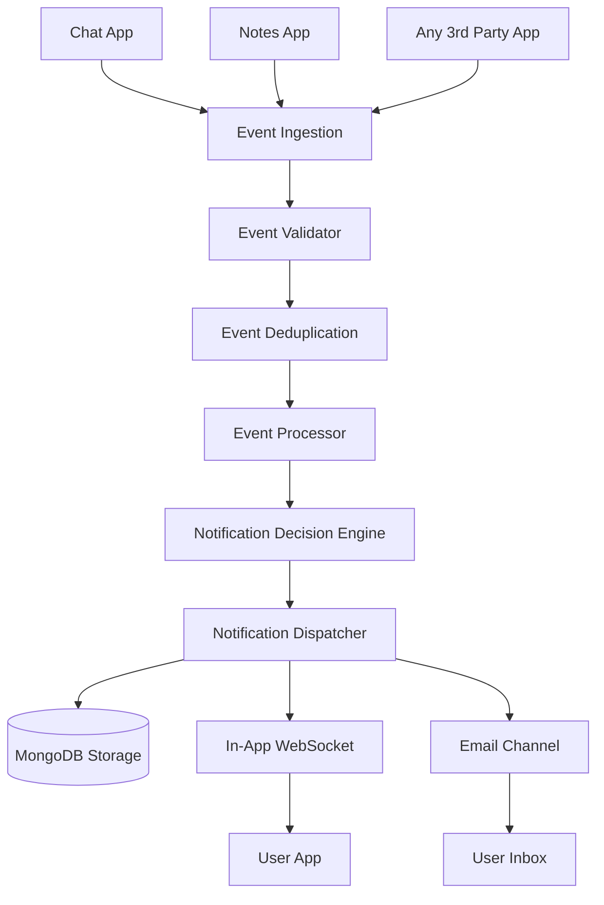

# Notification Engine

A modular, production-ready event-driven notification engine that ingests events from multiple producer applications (ChatApp, NotesApp, and generic external apps), respects user channel and topic preferences, deduplicates events, persists notifications in MongoDB, dispatches real-time in-app alerts via WebSockets, and provides REST APIs for notification management.

---

## Architecture & Flow



---

## Features

1. **Multi-App Event Ingestion**:
   - **ChatApp Events**: Direct messages (`chat.message_sent`), channel mentions (`chat.mention`).
   - **NotesApp Events**: Shared notes (`note.shared`), reminders (`note.reminder`), collaborator added (`note.collaborator_added`).
   - **Generic / Any 3rd Party App**: Auto-handles any custom event type (e.g., `invoice.generated`, `payment.received`, `order.shipped`).

2. **Deduplication Engine**:
   - Automatically detects duplicate `eventId` inputs and discards redundant re-transmissions.
   - Backed by MongoDB unique index with fallback in-memory caching.

3. **Decision & User Preference Engine**:
   - Granular user preferences: Global notifications toggle, channel-level controls (`inApp`, `email`), source muting (`mutedSources`), and type muting (`mutedTypes`).
   - Filters notifications prior to delivery based on recipient settings.

4. **Multi-Channel Real-time Dispatch**:
   - **In-App (WebSocket)**: Real-time push directly to connected browser/mobile sessions (`ws://localhost:5000?userId=<userId>`).
   - **Database Persistence**: Stores all notifications in MongoDB with unread/read state, timestamp, and metadata.
   - **Email Dispatcher**: Pluggable channel for email / external service notifications.

5. **RESTful Management APIs**:
   - Query user notifications, unread counts, and filter by read status.
   - Mark individual notifications or all notifications as read.
   - Read and update user preferences dynamically.


---

## Tech Stack

- **Runtime**: Node.js + TypeScript (ES Modules)
- **Framework**: Express.js
- **Database**: MongoDB (via Mongoose)
- **Real-time**: WebSockets (`ws`)

---

## Getting Started

### 1. Installation
```bash
npm install
```

### 2. Environment Configuration
Ensure `.env` contains your MongoDB URI and desired port:
```env
PORT=5000
MONGO_URI=mongodb+srv://<username>:<password>@cluster.mongodb.net/notification_engine
```

### 3. Start Development Server
```bash
npm run dev
```

The engine will start on `http://localhost:5000`:
- **WebSocket server**: `ws://localhost:5000?userId=<userId>`
- **Interactive UI Dashboard**: `http://localhost:5000/test.html`

---

## API Reference

### 1. Ingest Event
**`POST /event`**

**Headers**: `Content-Type: application/json`

**Payload Schema**:
```json
{
  "eventId": "evt_abc123",
  "type": "chat.message_sent",
  "source": "chatapp",
  "senderId": "user_bob",
  "recipientId": "user_alice",
  "timestamp": "2026-09-21T12:00:00.000Z",
  "data": {
    "senderName": "Bob",
    "text": "Hey Alice! Can you review this PR?"
  }
}
```

**NotesApp Example**:
```json
{
  "eventId": "evt_note_456",
  "type": "note.reminder",
  "source": "notesapp",
  "recipientId": "user_alice",
  "timestamp": "2026-09-21T12:00:00.000Z",
  "data": {
    "noteTitle": "Sprint Planning",
    "reminderText": "Meeting starts in 10 minutes"
  }
}
```

**Generic 3rd Party App Example**:
```json
{
  "eventId": "evt_billing_789",
  "type": "invoice.created",
  "source": "billing_service",
  "recipientId": "user_alice",
  "timestamp": "2026-09-21T12:00:00.000Z",
  "data": {
    "title": "Invoice #1042 Ready",
    "message": "Your monthly subscription invoice is ready for download."
  }
}
```

**Response**:
- `202 Accepted`: Event processed and dispatched.
- `200 OK`: Duplicate event ignored or event filtered by user preferences.
- `400 Bad Request`: Invalid event schema.

---

### 2. Notifications API

- **`GET /api/notifications?userId=<userId>&read=false&limit=20`**  
  Returns user notifications and current unread count.

- **`PATCH /api/notifications/:id/read`**  
  Marks a specific notification as read.

- **`PATCH /api/notifications/read-all`**  
  Marks all unread notifications for a user as read (`{ "userId": "user_alice" }`).

---

### 3. User Preferences API

- **`GET /api/preferences/:userId`**  
  Fetches notification preferences for a user.

- **`PUT /api/preferences/:userId`**  
  Updates preferences:
  ```json
  {
    "notificationsEnabled": true,
    "channels": {
      "inApp": true,
      "email": false
    },
    "mutedSources": ["marketing"],
    "mutedTypes": ["chat.mention"]
  }
  ```

