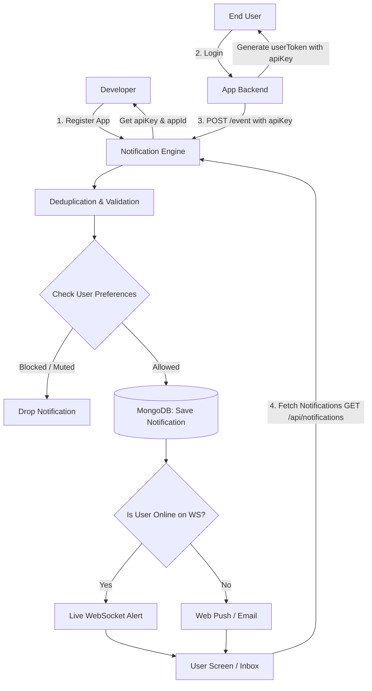

# Notification Engine (SaaS Event-Driven Alert Service)

A multi-tenant, event-driven notification engine that allows any third-party application (Chat, E-commerce, Notes, Billing, etc.) to trigger alerts, manage user preferences, persist notifications for offline access, and stream real-time in-app updates via WebSockets.

---

## 1. How It Works (The 30-Second Mental Model)


```mermaid
flowchart TD
    %% Step 1
    Dev[Developer] -->|1. Register App| Engine[Notification Engine]
    Engine -->|Get apiKey & appId| Dev

    %% Step 2
    User[End User] -->|2. Login| AppBackend[App Backend]
    AppBackend -->|Generate userToken with apiKey| User

    %% Step 3
    AppBackend -->|3. POST /event with apiKey| Engine
    Engine --> Deduplication[Deduplication & Validation]
    Deduplication --> Preferences{Check User Preferences}
    Preferences -->|Blocked / Muted| Dropped[Drop Notification]
    Preferences -->|Allowed| SaveDB[(MongoDB: Save Notification)]

    %% Step 4
    SaveDB --> OnlineCheck{Is User Online on WS?}
    OnlineCheck -->|Yes| SocketPush[Live WebSocket Alert]
    OnlineCheck -->|No| OfflinePush[Web Push / Email]
    SocketPush --> UserScreen[User Screen / Inbox]
    OfflinePush --> UserScreen

    %% Step 5
    UserScreen -->|4. Fetch Notifications GET /api/notifications| Engine
```
---

## 2. Security & The HMAC Token System

### HMAC Signatures
1. When **Bob** logs into his Chat/Parent App, the Chat App's backend generates a cryptographic signature:
   ```javascript
   const token = crypto.createHmac("sha256", SERVICE_KEY).update(bobId).digest("hex");
   ```
2. Bob's frontend sends this token with every request (`x-user-id` + `x-user-token`).
3. The Notification Engine verifies that the token matches the ID using constant-time verification.
4. **Result**: Complete isolation. Bob can never read or modify anyone else's notifications or settings.

---

## 3. Getting Started

### Prerequisites
- Node.js (v18+)
- MongoDB running locally or on Atlas

### Installation
```bash
npm install
```

### Start Server
```bash
npm run dev
```
The server will start on `http://localhost:5001`.

---

## 4. Integration Guide for Any Application

Integrating your application requires three simple steps:

### Step 1: Register Your Application & Get Your API Key
Any service (ChatApp, NotesApp, Store, etc.) registers once to receive their unique `appId` and `apiKey`:

```bash
POST http://localhost:5001/api/apps/register
Content-Type: application/json

{
  "name": "ChatApp",
  "description": "Team messaging and chat platform"
}
```

**Response**:
```json
{
  "message": "Application registered successfully! Keep your apiKey secure.",
  "appId": "app_9f2b8401",
  "name": "ChatApp",
  "apiKey": "ne_live_4a89bc21e780d601fbc349281a9420b..."
}
```
> 🔒 **Save your `apiKey` in your backend `.env`!** Never share this key with client/frontend code.

---

### Step 2: Emitting Events from Your Backend
When an action happens in your application, send a `POST /event` request from your backend using your `apiKey`:

```javascript
// Node.js Backend Example
import axios from "axios";

async function notifyUser() {
  await axios.post(
    "http://localhost:5001/event",
    {
      eventId: "evt_order_12345",         // Unique ID for deduplication
      type: "order.shipped",              // Any string you choose
      source: "ecommerce_store",          // Name of your service
      recipientId: "user_bob_99",         // User who receives the alert
      senderId: "system",                 // Optional: who triggered it
      timestamp: new Date().toISOString(),
      data: {
        title: "Your Order has Shipped! 📦",
        message: "Order #12345 is on the way.",
        url: "/orders/12345"              // Reference link for when clicked
      }
    },
    {
      headers: {
        "Content-Type": "application/json",
        "x-api-key": process.env.NOTIFICATION_API_KEY // Your app's secret API key
      }
    }
  );
}

```

---

### Step 3: Giving Your Frontend a User Token
When a user logs into your backend, sign an HMAC token with your `apiKey` and return it to the user's browser/app:

```javascript
// Inside your App's Login Controller
import crypto from "crypto";

export function loginUser(req, res) {
  const user = authenticate(req.body); // e.g. Bob
  
  // Create HMAC token using your App's API Key
  const notificationToken = crypto
    .createHmac("sha256", process.env.NOTIFICATION_API_KEY)
    .update(user.id)
    .digest("hex");

  res.json({
    userId: user.id,
    appId: process.env.NOTIFICATION_APP_ID, // e.g. "app_9f2b8401"
    notificationToken: notificationToken
  });
}
```


---

## 5. Client / Frontend Usage

In your frontend:

### 1. Fetching Notifications (Offline / Inbox)
```javascript
const res = await fetch("http://localhost:5001/api/notifications?read=false&limit=20", {
  headers: {
    "x-user-id": currentUserId,
    "x-user-token": userNotificationToken
  }
});
const data = await res.json();
console.log("Unread count:", data.unreadCount);
console.log("Notifications:", data.notifications);
```

### 2. Marking a Notification as Read
```javascript
await fetch(`http://localhost:5001/api/notifications/${notificationId}/read`, {
  method: "PATCH",
  headers: {
    "x-user-id": currentUserId,
    "x-user-token": userNotificationToken
  }
});
```

### 3. Real-Time In-App Alerts (WebSocket)
Connect to the WebSocket server to receive live push alerts when the user is actively using the app:

```javascript
const socket = new WebSocket(
  `ws://localhost:5001?userId=${currentUserId}&token=${userNotificationToken}`
);

socket.onmessage = (event) => {
  const alert = JSON.parse(event.data);
  console.log("New In-App Alert:", alert.data.title, alert.data.message);
  // Show popup / Toast banner on screen
};
```

### 4. Fetching & Updating User Preferences
Users can control what notifications they receive:

```javascript
// Fetch user preferences
const prefRes = await fetch("http://localhost:5001/api/preferences", {
  headers: {
    "x-user-id": currentUserId,
    "x-user-token": userNotificationToken
  }
});

// Update preferences (mute chat mentions, disable email)
await fetch("http://localhost:5001/api/preferences", {
  method: "PUT",
  headers: {
    "Content-Type": "application/json",
    "x-user-id": currentUserId,
    "x-user-token": userNotificationToken
  },
  body: JSON.stringify({
    notificationsEnabled: true,
    channels: {
      inApp: true,
      email: false,
      push: true
    },
    mutedSources: ["marketing"],
    mutedTypes: ["chat.mention"]
  })
});
```

---

## 6. API Reference Summary

| Endpoint | Method | Auth Header / Param | Description |
| :--- | :--- | :--- | :--- |
| `/event` | `POST` | `x-service-key: <key>` | Ingests a new event from a producer backend |
| `/api/notifications` | `GET` | `x-user-id`, `x-user-token` | Retrieves notifications & unread count |
| `/api/notifications/:id/read` | `PATCH` | `x-user-id`, `x-user-token` | Marks a specific notification as read |
| `/api/notifications/read-all` | `PATCH` | `x-user-id`, `x-user-token` | Marks all notifications as read |
| `/api/preferences` | `GET` | `x-user-id`, `x-user-token` | Retrieves user preference settings |
| `/api/preferences` | `PUT` | `x-user-id`, `x-user-token` | Updates user preference settings |
| `/?userId=<id>&token=<token>` | `WebSocket` | Query parameters | Real-time WebSocket connection for in-app popups |
| `/health` | `GET` | None | Engine health check |

---

## 7. Privacy & Data Handling Guarantees

- **No Raw Content Stored**: The engine only stores notification titles and safe truncated preview summaries (max 120 chars). Sensitive fields like raw chat bodies (`data.text`) are automatically purged before database persistence.
- **Deduplication Protection**: Re-sending the same `eventId` from the same source is automatically ignored by the engine to prevent spamming users.
- **Preference Enforcement**: If a user mutes a channel or source, the Decision Engine intercepts and drops the notification before dispatch.

